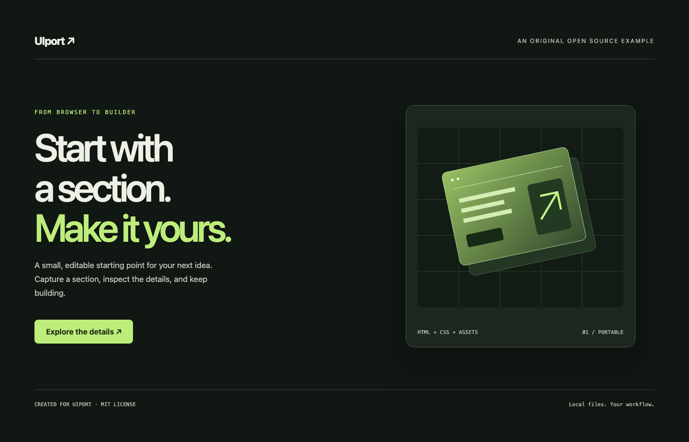

# UIport ↗

**Bring a web section into your next project.**

UIport captures a rendered section as editable HTML, original CSS and local assets. Inspect it, compare it with the source, and make it a starting point for your own work. Runs locally, from your terminal or coding agent. No account, API key or hosted service.

[Português brasileiro](README.pt-BR.md) · [Support matrix](docs/support.md) · [Contributing](CONTRIBUTING.md)

> **Release candidate:** the first npm release is pending. Use the source checkout below until `uiport@0.1.0` is published.



## What you get

```text
my-section/
├── index.html     # HTML, styles and supported animation replay
└── assets/        # Local images, fonts and other referenced resources
```

UIport keeps original CSS conservatively, including rules outside the selected section. It exports the first viewport's DOM and checks several screen sizes. It does **not** generate React components, crawl an entire site or recover arbitrary JavaScript behavior. Source scripts and inline event handlers are omitted. CSS motion and serializable Web Animations can travel with the section; framework runtimes require manual work.

## Quick start

Requires **Node.js 22.14+**; Node 24 LTS recommended. Chromium is installed explicitly, or UIport can use your installed Chrome/Edge. Your existing browser sessions are not imported.

After the npm release:

```sh
npx uiport@0.1.0 browser install
npx uiport@0.1.0 capture --url "https://your-site.example" --selector "#hero" --out ./my-section
npx uiport@0.1.0 serve --dir ./my-section
npx uiport@0.1.0 validate --url "https://your-site.example" --selector "#hero" --dir ./my-section
```

Choose the selector using your browser's **Inspect element** tool. It must match exactly one container, such as `main`, `section` or a `div`. Select a container inside `body`, not `html` or `body` itself.

For repeated use: `npm install -g uiport`, then `uiport --help`. Pin a version for repeatable captures; `npx uiport@latest` follows future releases.

### Try the original example from source

```sh
git clone https://github.com/LorranHippolyte/uiport.git
cd uiport
npm ci
node bin/cli.mjs browser install
node bin/cli.mjs serve --dir examples/responsive-hero --port 4173
```

In another terminal, from the same directory:

```sh
node bin/cli.mjs capture --url http://127.0.0.1:4173 --selector '#hero' --out ./extractions/hero
node bin/cli.mjs validate --url http://127.0.0.1:4173 --selector '#hero' --dir ./extractions/hero
node bin/cli.mjs serve --dir ./extractions/hero --port 4174
```

Open `http://127.0.0.1:4174`. You can move that output directory and serve it again. The second example, `examples/css-motion`, uses selector `#motion` and includes hover/focus states and CSS animations. Both examples and their illustrations were created for UIport.

## Commands

| Command | Purpose |
|---|---|
| `capture --url URL --selector CSS --out DIR` | Capture one rendered section |
| `serve --dir DIR --port 4173` | Preview on loopback; stop with Ctrl+C |
| `validate --url URL --selector CSS --dir DIR` | Compare screenshots and observe resource errors |
| `browser install` | Install Chromium matched to the bundled Playwright version |
| `--help` / `--version` | Inspect the CLI without starting a browser |

`capture` and `validate` share `--viewports`, `--wait`, `--timeout`, `--max-scroll-steps`, `--locale`, `--color-scheme` and `--json`. Defaults: four viewports (`1440x900,1024x768,768x1024,375x812`), 1200 ms settle time, 120 s whole-operation deadline and 80 scroll steps.

Capture limits copied resources to 20 MiB each and 100 MiB in total. Override with `--max-resource-mb` and `--max-total-mb`. These bound the export downloader, not the source browser's complete memory use. Resource fetching also has a 15 s request deadline.

Set `UIPORT_BROWSER_PATH` to explicitly choose an executable. Otherwise UIport tries its compatible Chromium, then installed Chrome and Edge, including on macOS.

### Read the result

- **Capture exit 0:** artifact produced with no known reported limitations. This is not a guarantee of full behavioral equivalence.
- **Capture exit 2:** artifact produced, with explicit limitations. Read `limitations` before using it.
- **Exit 1:** command failed, or validation failed its requested checks.
- **Validation exit 0:** the observed visual/network checks passed. Behavior remains `not-tested`.

`--json` produces one result on stdout for capture/validate/browser; progress goes to stderr. `serve --json` emits one readiness document and stays running until stopped. A script calling capture must handle exit 2, not treat every nonzero exit as “no files”. An existing nonempty output directory is never overwritten.

Validation disables animations for screenshots. It compares pixels with a default 2% difference allowance and up to 5 px height difference; this does not certify hover, clicks, scroll animation or framework state. External requests are **blocked by default** in the exported page, including another localhost port. `--allow-external` opts out of that offline check. Inspect the [support matrix](docs/support.md) before interpreting a passing result.

## Use with a coding agent

Start with [uiport.md](uiport.md). Read [skills/uiport/SKILL.md](skills/uiport/SKILL.md), or copy it into your agent's skill directory. The same file ships with the npm package. The agent should capture, read limitations, inspect supported interactions and validate, without inventing replacement effects. No LLM API is called by UIport itself.

## Contribute

Bug reports, reduced test cases, documentation and improvements to resource handling are welcome. Start with [CONTRIBUTING.md](CONTRIBUTING.md) and our [architecture](docs/architecture.md). Use original local fixtures rather than committing captured client websites. Supported development checks are `npm run check` after browser installation.

## People and license

Created and maintained by **[Lorran Hippolyte](https://github.com/LorranHippolyte)**, with development and maintenance by **LuminaSoft**. Shared with the **AI Coders Academy** community.

UIport's original code and examples are [MIT licensed](LICENSE). Use pages you own or have permission to reuse. The license does not grant rights to third-party captured content; see [NOTICE](NOTICE). [Security reporting](SECURITY.md) · [Governance](GOVERNANCE.md) · [Code of conduct](CODE_OF_CONDUCT.md).
