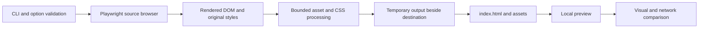

# Architecture

UIport is one JavaScript ESM package with a CLI. No server backend, database, user accounts, telemetry or LLM provider is involved. The preview HTTP server binds only to loopback.

- `bin/cli.mjs`: dispatch, help, version, structured results, explicit browser install.
- `scripts/options.mjs`: strict arguments, URL/number/viewport validation.
- `scripts/capture.mjs`: capture orchestration, staged filesystem output, metadata and exact-data WAAPI replay.
- `scripts/dom.mjs`: browser-side DOM serialization; removes source script/handler execution, handles open shadow trees, records styles and animation data.
- `scripts/resources.mjs`: streamed size/deadline limits, hash-named assets, PostCSS import processing and URL rewriting. Public resources are fetched without imported browser sessions.
- `scripts/validate.mjs`: isolated source/output contexts, screenshot comparison, resource and execution diagnostics. Does not infer behavioral equivalence.
- `scripts/lib.mjs`: browser discovery, lifecycle cleanup, static server confinement, serialization and staging utilities.
- `examples/`: original MIT-licensed material for onboarding and repeatable tests.

The original extractor's browser serialization and pixel comparison were retained and separated into testable modules. CSS is deliberately conservative in 0.1. Complete CSS pruning, framework code generation and generic runtime isolation are not included.

The output transaction never overwrites a nonempty directory. Work happens in a sibling temporary folder and is moved only after serialization succeeds; temporary files are cleaned after failures. Concurrent edits to an originally empty destination cause commit to fail instead of replacing the new content.

`npm run typecheck` checks JSDoc-annotated argument and resource boundaries. It is not a claim of full static typing of browser-serialized DOM code. Syntax, ESLint and browser integration tests cover the remaining JavaScript. The package needs no transpilation.
